# 📚 ChatWithDocs: Enterprise RAG Knowledge Assistant

**ChatWithDocs** is a retrieval-augmented generation (RAG) application designed to interact with private, unstructured data. By leveraging vector embeddings and large language models (LLMs), it allows users to upload PDF documents and ask context-aware questions with high semantic accuracy.

## 🧠 Key Features

* **RAG Architecture:** Implements a full RAG pipeline (Ingestion $\to$ Chunking $\to$ Embedding $\to$ Retrieval $\to$ Generation) to ground LLM responses in factual document data.
* **Privacy-First Embeddings:** Uses local **HuggingFace Embeddings** (`all-MiniLM-L6-v2`) to process sensitive data without sending document vectors to external APIs.
* **Vector Search:** Integrated with **ChromaDB** for high-performance similarity search and efficient knowledge retrieval.
* **Source Citation:** Enhances trust by providing source context (citations) for every generated answer, mitigating model hallucinations.
* **Cost-Efficient:** Powered by **Meta Llama 3** (via Groq) for ultra-fast inference at near-zero cost.

## 🏗️ Architecture

```mermaid
graph LR
    PDF[📄 PDF Document] -->|PyPDF Loader| Text[Raw Text]
    Text -->|Recursive Splitter| Chunks[Text Chunks]
    Chunks -->|HuggingFace Model| Vectors[Vector Embeddings]
    Vectors -->|Store| DB[(ChromaDB)]
    
    User[User Question] -->|Embed| QueryVector
    QueryVector -->|Similarity Search| DB
    DB -->|Retrieve Top-K| Context
    Context -->|Augment Prompt| LLM[🦙 Llama 3]
    LLM -->|Generate| Answer[Final Answer]
```

🛠️ Tech Stack
LLM Framework: LangChain (Community & Core)

Model: Meta Llama 3.3 (via Groq API)

Vector Database: ChromaDB

Embeddings: HuggingFace (sentence-transformers/all-MiniLM-L6-v2)

Frontend: Streamlit

Deployment: Streamlit Community Cloud

🚀 Quick Start
Prerequisites
Python 3.9+

Groq API Key

Installation
Clone the repository

Bash

git clone https://github.com/yourusername/ChatWithDocs.git
cd ChatWithDocs
Install dependencies

Bash

pip install -r requirements.txt
Configure Environment Create a .env file in the root directory:

Code snippet

GROQ_API_KEY=your_groq_api_key_here
Run the Application

Bash

streamlit run main.py
💡 How It Works
Ingestion: The app loads your PDF and splits it into smaller, overlapping chunks (to preserve context).

Embedding: Each chunk is converted into a numerical vector using a local embedding model.

Retrieval: When you ask a question, the system searches ChromaDB for the chunks mathematically closest to your query.

Generation: The LLM receives your question along with the retrieved chunks to generate a grounded answer.

📄 License
Distributed under the MIT License.
