# 📚 ChatWithDocs: Enterprise RAG Knowledge Assistant


**ChatWithDocs** is a retrieval-augmented generation (RAG) application designed to interact with private, unstructured data. By leveraging vector embeddings and large language models (LLMs), it allows users to upload PDF documents and ask context-aware questions with high semantic accuracy.


## 🧠 Key Features

* **RAG Architecture:** Implements a full RAG pipeline (Ingestion $\to$ Chunking $\to$ Embedding $\to$ Retrieval $\to$ Generation) to ground LLM responses in factual document data.
* **Privacy-First Embeddings:** Uses local **HuggingFace Embeddings** (`all-MiniLM-L6-v2`) to process sensitive data without sending document vectors to external APIs.
* **Vector Search:** Integrated with **ChromaDB** for high-performance similarity search and efficient knowledge retrieval.
* **Source Citation:** Enhances trust by providing source context (citations) for every generated answer, mitigating model hallucinations.
* **Cost-Efficient:** Powered by **Meta Llama 3** (via Groq) for ultra-fast inference at near-zero cost.

## 🏗️ Architecture

```mermaid
graph LR
    PDF[📄 PDF Document] -->|PyPDF Loader| Text[Raw Text]
    Text -->|Recursive Splitter| Chunks[Text Chunks]
    Chunks -->|HuggingFace Model| Vectors[Vector Embeddings]
    Vectors -->|Store| DB[(ChromaDB)]
    
    User[User Question] -->|Embed| QueryVector
    QueryVector -->|Similarity Search| DB
    DB -->|Retrieve Top-K| Context
    Context -->|Augment Prompt| LLM[🦙 Llama 3]
    LLM -->|Generate| Answer[Final Answer]
```




🛠️ Tech Stack
LLM Framework: LangChain (Community & Core)

Model: Meta Llama 3.3 (via Groq API)

Vector Database: ChromaDB

Embeddings: HuggingFace (sentence-transformers/all-MiniLM-L6-v2)

Frontend: Streamlit

Deployment: Streamlit Community Cloud

## 🚀 Quick Start

### Prerequisites
* Python 3.9+
* Groq API Key

### Installation

1.  **Clone the repository**
    ```bash
    git clone [https://github.com/yourusername/ChatWithDocs.git](https://github.com/yourusername/ChatWithDocs.git)
    cd ChatWithDocs
    ```

2.  **Install dependencies**
    ```bash
    pip install -r requirements.txt
    ```

3.  **Configure Environment**
    Create a `.env` file in the root directory:
    ```env
    GROQ_API_KEY=your_groq_api_key_here
    ```

4.  **Run the Application**
    ```bash
    streamlit run main.py
    ```

## 💡 How It Works


[Image of Retrieval Augmented Generation flow diagram]


1.  **Ingestion:** The app loads your PDF and splits it into smaller, overlapping chunks (to preserve context).
2.  **Embedding:** Each chunk is converted into a numerical vector using a local embedding model.
3.  **Retrieval:** When you ask a question, the system searches ChromaDB for the chunks mathematically closest to your query.
4.  **Generation:** The LLM receives your question along with the retrieved chunks to generate a grounded answer.

## 📄 License
Distributed under the MIT License.
